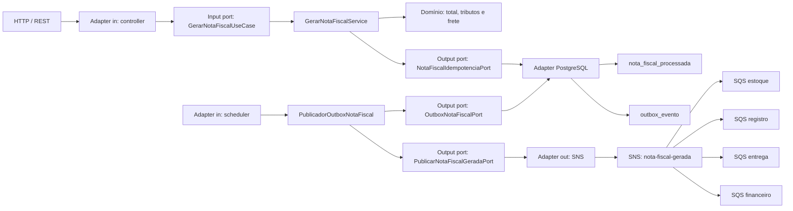

# Arquitetura hexagonal, idempotência e eventos

## Fluxo principal

As regras de emissão permanecem independentes de HTTP, JDBC, Spring e AWS. O caso de uso conhece apenas portas de saída. PostgreSQL local e Aurora PostgreSQL em AWS são detalhes do adapter de persistência.

Na primeira chamada de um `pedido_id`, a nota e o evento de outbox são gravados na mesma transação. Chamadas repetidas retornam a resposta persistida. A chave primária de `nota_fiscal_processada` garante a decisão mesmo quando duas instâncias recebem o pedido simultaneamente.

## Responsabilidades por camada

- `domain`: modelos, exceções e regras de cálculo puras.
- `application.port.in`: contrato dos casos de uso.
- `application.port.out`: idempotência, outbox, publicação e acesso a segredos, sem SDK ou banco no contrato.
- `application.service`: coordenação do domínio, criação do evento e relay da outbox.
- `adapter.in.web`: DTOs, validação, mapeamento HTTP, controller, rastreabilidade e tratamento de erros.
- `adapter.in.scheduler`: dispara periodicamente o relay da outbox.
- `adapter.out.persistence.postgresql`: implementa idempotência e outbox com JDBC.
- `adapter.out.aws`: publica no SNS e lê o Secrets Manager.
- `config`: composition root, properties, clients e agendamento.

## Idempotência e consistência

A identidade da operação é o `pedido_id`, pois a regra do case considera cada pedido único. A mesma chave deve representar o mesmo comando; reutilizar um identificador para outro conteúdo é erro de contrato do chamador.

O transactional outbox evita o dual-write banco/SNS:

1. calcula a nota;
2. grava a resposta idempotente e o evento `PENDENTE` em uma única transação;
3. responde a API após o commit;
4. o relay reserva eventos com `FOR UPDATE SKIP LOCKED`;
5. publica no SNS e marca `PUBLICADO`;
6. em falha, reagenda com exponential backoff; ao esgotar tentativas, marca `FALHA`.

Se o processo cair depois de publicar e antes de confirmar no banco, o evento poderá ser reenviado. Isso é esperado em uma entrega *at least once*: cada consumidor deve persistir a `idempotency_key` atomicamente com seu efeito. O banco do produtor garante uma nota/outbox por pedido, mas não substitui a idempotência de estoque, registro, entrega e financeiro.

## Contrato HTTP e erros

- `400 PAYLOAD_INVALIDO`: campo obrigatório ausente, coleção vazia ou número inválido.
- `400 PAYLOAD_ILEGIVEL`: JSON, data ou enum que não pode ser interpretado.
- `422 REGRA_NEGOCIO_INVALIDA`: tipo de pessoa ou regime tributário sem regra implementada.
- `503 PERSISTENCIA_INDISPONIVEL`: não foi possível consultar ou confirmar a transação no banco.
- `500 ERRO_INTERNO`: falha inesperada sem exposição de detalhes internos.

Todos os erros devolvem `correlation_id`, `flow_id`, código estável, status, mensagem e caminho. A publicação é assíncrona; indisponibilidade momentânea do SNS não transforma uma nota já persistida em erro HTTP.

## Contrato e entrega do evento

`NotaFiscalGerada` versão `1` contém `event_id`, `event_type`, `event_version`, `occurred_at`, `correlation_id`, `flow_id`, `idempotency_key`, `pedido_id` e `nota_fiscal`. A chave estável é `nota-fiscal-gerada:pedido:<pedidoId>`.

- O SDK AWS possui retry com exponential backoff e full jitter.
- O relay da outbox possui retry durável com backoff configurável.
- Cada fila possui DLQ própria e redrive policy.
- Filas separadas isolam falhas e backlog dos quatro consumidores.
- A policy SQS aceita mensagens somente do tópico esperado.

## Ambientes e infraestrutura

- `local`: PostgreSQL 16 e LocalStack via Docker Compose.
- `dev`, `homol` e `prod`: URL e credenciais do banco chegam por variáveis/injeção segura; o código JDBC e as migrations são os mesmos.
- AWS: Terraform cria Aurora PostgreSQL Serverless v2 privado, criptografado, com credencial master gerenciada pelo RDS no Secrets Manager.

O PostgreSQL local não emula o mecanismo distribuído do Aurora, mas usa o mesmo protocolo, dialeto, transações e schema necessários ao código. Failover, scaling e rede multi-AZ são validados apenas em AWS.

## Testes

- Testes unitários cobrem domínio, aplicação, adapters e erros da API.
- Testes MVC garantem payload `snake_case`, validações `400` e regras `422`.
- Testcontainers sobe PostgreSQL 16, aplica Flyway e testa transação, concorrência, locks e retries.
- Testcontainers sobe LocalStack, cria SNS/SQS/DLQs/Secrets Manager e verifica o fan-out real.
- O gate JaCoCo exige 100% de linhas e branches por classe.

A decisão está registrada em [ADR-001](docs/ADR-001-idempotencia-e-transactional-outbox.md).
