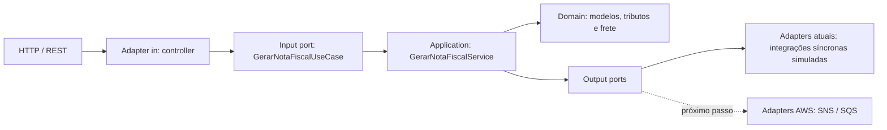

# Arquitetura hexagonal

## Objetivo

A aplicação está organizada para que as regras de emissão da nota fiscal não dependam de HTTP, Spring ou das tecnologias usadas nas integrações externas. As dependências apontam dos adaptadores para o núcleo.

## Pacotes

- `domain`: modelos, exceções e regras de negócio puras. Não depende de Spring ou Jackson.
- `application.port.in`: contrato dos casos de uso disponibilizados pela aplicação.
- `application.port.out`: contratos das capacidades externas exigidas pelo caso de uso.
- `application.service`: orquestra o domínio e as portas, sem conhecer implementações externas.
- `adapter.in.web`: recebe o contrato HTTP e aciona a porta de entrada.
- `adapter.out.integration`: implementa as portas de saída. Nesta versão, preserva as latências simuladas do desafio.
- `config`: composition root; é o único lugar que instancia e conecta o núcleo aos adaptadores usando Spring.

## Portas de saída

As portas descrevem intenções do negócio, não tecnologias:

- `BaixarEstoquePort`;
- `RegistrarNotaFiscalPort`;
- `AgendarEntregaPort`;
- `EnviarNotaFiscalFinanceiroPort`.

Na evolução assíncrona, os adaptadores atuais poderão ser substituídos por adaptadores publicadores sem alterar o domínio, o caso de uso ou o controller. SNS e SQS devem aparecer apenas nos pacotes de adapter e configuração.

## Contrato HTTP

O payload permanece em `snake_case`. A convenção foi movida das classes de domínio para a configuração do Jackson, evitando anotações de serialização dentro do núcleo.
