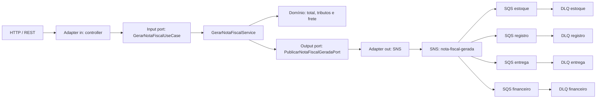

# Arquitetura hexagonal e orientada a eventos

## Fluxo principal

As regras de emissão da nota fiscal continuam independentes de HTTP, Spring e AWS. O caso de uso depende da porta `PublicarNotaFiscalGeradaPort`; somente o adapter de saída conhece o SDK do SNS.

## Responsabilidades por camada

- `domain`: modelos, exceções e regras de cálculo puras.
- `application.port.in`: contrato dos casos de uso.
- `application.port.out`: capacidades externas exigidas pela aplicação, sem tecnologia no contrato.
- `application.service`: coordenação do domínio e das portas.
- `adapter.in.web`: DTOs, validação, mapeamento HTTP, controller, rastreabilidade e tratamento de erros.
- `adapter.out.aws`: publicação SNS e leitura do Secrets Manager.
- `config`: composition root, propriedades e clientes AWS.

## Contrato HTTP e erros

O payload original permanece em `snake_case`. DTOs específicos da API aplicam Bean Validation antes de converter os dados para o domínio.

- `400 PAYLOAD_INVALIDO`: campo obrigatório ausente, coleção vazia ou número inválido.
- `400 PAYLOAD_ILEGIVEL`: JSON, data ou enum que não pode ser interpretado.
- `422 REGRA_NEGOCIO_INVALIDA`: tipo de pessoa ou regime tributário sem regra implementada.
- `503 MENSAGERIA_INDISPONIVEL`: não foi possível confirmar a publicação no SNS após os retries.
- `500 ERRO_INTERNO`: falha inesperada sem exposição de detalhes internos.

Todos os erros devolvem `correlation_id`, `flow_id`, código estável, status, mensagem e caminho.

## Contrato do evento

`NotaFiscalGerada` começa na versão `1` e contém:

- `event_id`: identifica uma publicação específica;
- `event_type` e `event_version`: permitem evolução compatível do schema;
- `occurred_at`: instante UTC da ocorrência;
- `correlation_id` e `flow_id`: propagam a rastreabilidade HTTP;
- `idempotency_key`: chave estável `nota-fiscal-gerada:pedido:<pedidoId>`;
- `pedido_id` e `nota_fiscal`: dados de negócio.

Os mesmos metadados relevantes também são enviados como message attributes do SNS. Cada consumidor deve registrar atomicamente a `idempotency_key` antes de executar seu efeito e considerar uma chave já concluída como sucesso, pois SNS/SQS trabalha com entrega pelo menos uma vez.

## Confiabilidade

- O SDK AWS faz até quatro tentativas, com exponential backoff e full jitter configuráveis.
- Cada fila possui uma DLQ própria e `maxReceiveCount=3`.
- A policy de cada fila permite `sqs:SendMessage` somente a partir do tópico esperado.
- Filas separadas isolam falhas e backlog de estoque, registro, entrega e financeiro.
- O adapter converte falhas do SDK em exceções da aplicação; o endpoint não responde sucesso sem a confirmação do SNS.

A decisão sobre transactional outbox e seus trade-offs está em [ADR-001](docs/ADR-001-eventos-e-confiabilidade.md).

## Ambientes e segredos

Existem profiles `local`, `dev`, `homol` e `prod`. Apenas `local` define endpoint e credenciais fictícias para o LocalStack. Nos ambientes AWS, endpoint e chaves ficam vazios para que o SDK use o endpoint oficial e a cadeia padrão de credenciais, preferencialmente IAM Role da workload.

O nome do segredo é configuração; seu valor é recuperado pela porta `BuscarSegredoPort` e pelo adapter do Secrets Manager. Valores secretos não são gravados nos profiles nem nos logs.

O Terraform em `infra/terraform` provisiona os mesmos recursos em AWS, incluindo criptografia gerenciada, policies restritas ao tópico e o container do secret no Secrets Manager. O valor do segredo deve ser inserido por um processo seguro separado, evitando armazená-lo no código ou no state do Terraform.

## Testes

- Testes unitários cobrem domínio, aplicação, adapters e erros da API.
- Testes MVC garantem o payload `snake_case`, validações `400` e regra de negócio `422`.
- Testcontainers provisiona SNS, quatro SQS com DLQ e Secrets Manager no LocalStack, publica pelo adapter real e verifica o fan-out.
- Sem Docker disponível, somente os dois testes de infraestrutura são ignorados; a suíte unitária continua executando.
