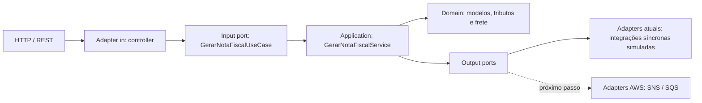

# Arquitetura hexagonal

## Objetivo

A aplicação está organizada para que as regras de emissão da nota fiscal não dependam de HTTP, Spring ou das tecnologias usadas nas integrações externas. As dependências apontam dos adaptadores para o núcleo.

## Pacotes

- `domain`: modelos, exceções e regras de negócio puras. Não depende de Spring ou Jackson.
- `application.port.in`: contrato dos casos de uso disponibilizados pela aplicação.
- `application.port.out`: contratos das capacidades externas exigidas pelo caso de uso.
- `application.service`: orquestra o domínio e as portas, sem conhecer implementações externas.
- `adapter.in.web`: recebe o contrato HTTP e aciona a porta de entrada.
- `adapter.out.integration`: implementa as portas de saída. Nesta versão, preserva as latências simuladas do desafio.
- `config`: composition root; é o único lugar que instancia e conecta o núcleo aos adaptadores usando Spring.

## Portas de saída

As portas descrevem intenções do negócio, não tecnologias:

- `BaixarEstoquePort`;
- `RegistrarNotaFiscalPort`;
- `AgendarEntregaPort`;
- `EnviarNotaFiscalFinanceiroPort`.

Na evolução assíncrona, os adaptadores atuais poderão ser substituídos por adaptadores publicadores sem alterar o domínio, o caso de uso ou o controller. SNS e SQS devem aparecer apenas nos pacotes de adapter e configuração.

## Contrato HTTP

O payload permanece em `snake_case`. A convenção foi movida das classes de domínio para a configuração do Jackson, evitando anotações de serialização dentro do núcleo.

## Logs

Os logs são emitidos nas fronteiras HTTP, no caso de uso e nos adaptadores de saída. O domínio continua sem dependência de framework de logging.

O caso de uso principal registra apenas início, conclusão e falha geral. Os detalhes ficam distribuídos nos colaboradores responsáveis por totalização, tributação, frete, criação da nota e integrações externas, evitando concentrar observabilidade e regras em uma única classe.

- `INFO`: entrada e saída da API, início e conclusão do processamento, resultados dos cálculos e chamadas externas;
- `DEBUG`: catálogo completo de faixas tributárias recuperado;
- `WARN`: interrupções e fluxo conhecido de alta latência da entrega;
- `ERROR`: falha na geração ou devolução da nota fiscal.

Os registros usam `pedidoId` e `notaFiscalId` para correlação. O payload completo, documentos e endereços não são registrados para evitar exposição de dados pessoais. O nível da aplicação pode ser alterado pela variável `LOG_LEVEL_APP`, com `INFO` como padrão.

### Identificadores de rastreabilidade

- `X-Correlation-Id`: identifica uma cadeia de chamadas ou sessão lógica. O consumidor pode enviar o valor recebido anteriormente para correlacionar várias requisições. Quando ausente ou inválido, a aplicação gera um UUID.
- `X-Flow-Id`: identifica exclusivamente uma execução da API e sempre é gerado pela aplicação.

Os dois identificadores são devolvidos nos headers HTTP e adicionados ao MDC como `correlationId` e `flowId`. O padrão do console os inclui automaticamente em todos os logs executados na mesma thread.

Quando as integrações forem migradas para SNS/SQS, esses valores deverão ser publicados como message attributes. O consumidor deverá reconstruir o MDC antes do processamento e limpá-lo ao final, preservando a correlação através do fluxo assíncrono.
